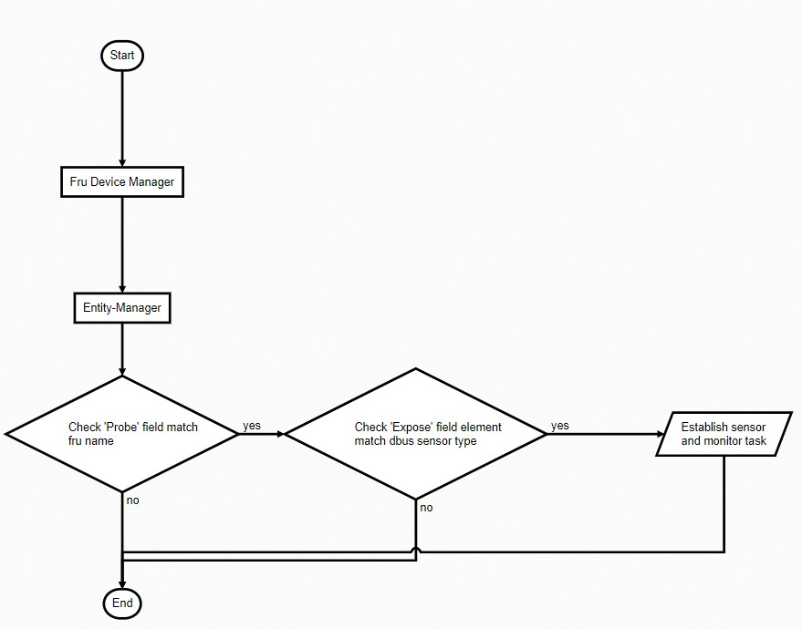

# Entity-Manager
Entity manager is a runtime configuration application which parses configuration files (in JSON format) and attempts to detect the devices described by the configuration files. It also can, based on the configuration, attempt to load install devices into sysfs. It takes these configurations and produces a best representation of the files on dbus using the xyz.openbmc_project.Configuration namespace. It also produces a system.json file for persistence.
[Configure rule](https://github.com/openbmc/entity-manager)

### Entity-Manager flowchart


There are two services for this recipe, 

**FruDevice service** is used to automatically scan Fru devices to ensure which platform or SKU it is.

**EntityManager service** is used to parse configuration files and establish sensor and monitoring tasks for further use.

All sensor type define in configuration file must be predefine in **dbus-sensors** recipes.

###  Sensor Type Support List

 | dbus-sensor class    | Support type | Class |Memo |
 | -------------------  | ------------- | -----| --------|
 | HwmonTemp      | EMC1413, MAX31725,MAX31730, MAX6581, MAX6654, SBTSI, TMP112, TMP175, TMP421, TMP441, TMP75 | - | |
 | Fan           | AspeedFan, I2CFan, NuvotonFan |-| |
 | PSUSensor     | ADM1272, ADM1278, INA219, INA230, ISL68137, MAX16601, MAX20730, MAX20734, MAX20796, MAX34451, PXE1610, pmbus,PXE1610,RAA228228 |-| |
 | NVMESesnor     | NVME1000   |-||
 | IpmbSensor      | IpmbSensor  |METemp, PxeBridgeTemp, IRBridgeTemp, HSCBridge, MpsBridge |If peci not support, we can use it for sending nm raw command to get dimm and CPU temp|
 | CPUSensor| XeonCPU            | Include dimm and CPU temp (need peci support)|
 | ADCSensor| ADC | | |

## Sensor Implement Step ##
  1. Extablish sensor device in dts file
  2. Define configuration file

## HS9216 Implement Example
**Device tree**

*ADCSensor*
```
 iio-hwmon {
                compatible = "iio-hwmon";
                io-channels = <&adc 0>, <&adc 1>, <&adc 2>, <&adc 3>,
                        <&adc 4>, <&adc 5>, <&adc 6>, <&adc 7>,
                        <&adc 8>, <&adc 9>, <&adc 10>, <&adc 11>, <&adc 12>,
                        <&adc 13>, <&adc 14>, <&adc 15>;
        };
 &adc { 
        status = "okay";
};
```
*CPUSensor*
```
&peci0 {
   status = "okay";
};
```
*FanSensor*
```
&pwm_tacho {
        status = "okay";
        pinctrl-names = "default";
        pinctrl-0 = <&pinctrl_pwm0_default &pinctrl_pwm1_default
                         &pinctrl_pwm2_default &pinctrl_pwm3_default
                         &pinctrl_pwm4_default &pinctrl_pwm5_default
                         &pinctrl_pwm6_default &pinctrl_pwm7_default>;
        fan@0 {
                reg = <0x00>;
                aspeed,fan-tach-ch = /bits/ 8 <0x00>;
        };

        fan@1 {
                reg = <0x00>;
                aspeed,fan-tach-ch = /bits/ 8 <0x01>;
        };
```
*PSU Sensor*
```
power-supply@58 {
                compatible = "ibm,cffps1";
                reg = <0x58>;
        };
```
**Configuration - Basic structure**
```
{
    "Exposes" : {
    `
    {Sensor configuration}
    `
    },
    "Name": "hs9216 Main Board",
    `
    "Probe": "xyz.openbmc_project.FruDevice({'BOARD_PRODUCT_NAME' : '.*9216*'})",
    `
    "Type": "Board",
    "xyz.openbmc_project.Inventory.Decorator.Asset": {
        "Manufacturer": "$PRODUCT_MANUFACTURER",
        "Model": "$PRODUCT_PRODUCT_NAME",
        "PartNumber": "$PRODUCT_PART_NUMBER",
        "SerialNumber": "$PRODUCT_SERIAL_NUMBER"
    }    
}
```
**Configuration - Sensor configuration in Exposes field**

*ADCSensor*
```
{
            "Index": 0,
            "Name": "VOL_SYS_V",
            "PowerState": "On",
            "ScaleFactor": 0.1124,
            "MaxValue": 5,
            "MinValue": 0,
            "Thresholds": [
                {
                    "Direction": "greater than",
                    "Name": "upper critical",
                    "Severity": 1,
                    "Value": 12.6
                },
                {
                    "Direction": "less than",
                    "Name": "lower critical",
                    "Severity": 1,
                    "Value": 11.4
                }
            ],
            "Type": "ADC"
}
```         
*Temperature Sensor*
```
{
            "Address": "0x49",
            "Bus": 6,
            "Name": "TEMP_AMB_0",
            "Thresholds": [
                    {
                        "Direction": "greater than",
                        "Name": "upper critical",
                        "Severity": 1,
                        "Value": 40
                    }
            ],
            "Type": "TMP75"
}
```
*CPUSensor*
```
       {
            "Address": "0x30",
            "Bus": 0,
            "CpuID": 1,
            "DtsCritOffset": -2.0,
            "Name": "CPU 1",
            "Thresholds": [
                {
                    "Direction": "greater than",
                    "Label": "DIMM",
                    "Name": "upper critical",
                    "Severity": 1,
                    "Value": 99
                },
                {
                    "Direction": "greater than",
                    "Label": "DIMM",
                    "Name": "upper non critical",
                    "Severity": 0,
                    "Value": 89
                }
            ],
            "Type": "XeonCPU"
        },
```        
*FanSensor*
 ```
 {
		    "Connector": {
                "Name": "Sys FAN Connector 3",
                "Pwm": 2,
                "Tachs": [
                    3
                ]
            },		
            "Index": 3,
            "Name": "FAN_3",
            "Thresholds": [
                {
                    "Direction": "less than",
                    "Name": "lower critical",
                    "Severity": 1,
                    "Value": 1000
                }
            ],
            "Type": "AspeedFan"
}            
```
  
 *IPMB Sensor*
Include PCH Temp
```
Address": "0x8",
            "Class": "METemp",
            "Name": "PCH Temp",
            "PowerState": "On",
            "Thresholds": [
                {
                    "Direction": "greater than",
                    "Name": "upper critical",
                    "Severity": 1,
                    "Value": 86
                }
            ],
            "Type": "IpmbSensor"
```
*PSU Sensor*
We can use individual json configuration file to define  PSU sensor (need PSU fru support) or directly setup PSU related setting at the same configuration file.
```
{
                "Address": "0x58",
                "Bus": "$bus",
                "Name": "PSU",
                "Labels": ["pin", "pout1", "vin", "vout1", "iin", "iout1", "temp1", "fan1"],
                "Thresholds": [
                    {
                        "Direction": "greater than",
                        "Label": "pin",
                        "Name": "upper critical",
                        "Severity": 1,
                        "Value": 750
                    }, 
                    ...
                    {
                        "Direction": "less than",
                        "Label": "vin",
                        "Name": "lower critical",
                        "Severity": 1,
                        "Value": 81.03
                    }
        ],
        "Type": "pmbus"
```
*PID config*
Detail configuration refer to [How to configure phosphor-pid-control](https://github.com/openbmc/phosphor-pid-control/blob/master/configure.md)


