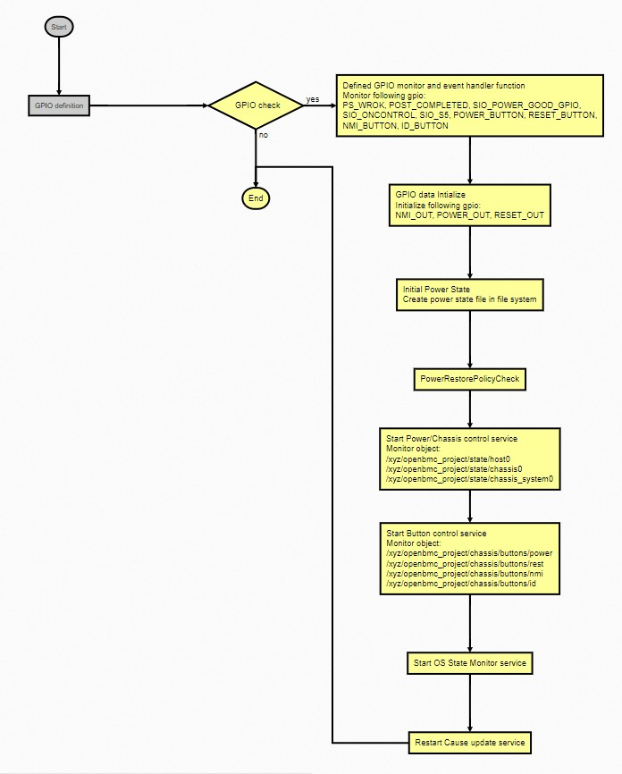

# X86-power-control
### GPIO Pre-Defined
X86-power-control need the follwoing GPIO definitions which must pre define in DTS file.
> | GPIO List (Default name)    | Pin in HS9216 |
> | ------------  | ------------- |
> | RESET_BUTTON  | GPIOE0        | 
> | RESET_OUT     | GPIOE1        |
> | POWER_BUTTON  | GPIOE2        |
> | POWER_OUT     | GPIOE3        |
> | PS_PWROK      | GPIOS1        |
> | SIO_POWER_GOOD| x             |
> | SIO_ONCONTROL | x             |
> | SIO_S5        | x             |
> | NMI_BUTTON    | GPIOE4        |
> | NMI_OUT       | GPIOE5        |
> | ID_BUTTON     | GPIOS0        |
> | POST_COMPLETE | GPIOAA7       |

GPIO definition in DTS file
```&gpio {
       status = "okay";
       gpio-line-names =
       "","","","","","","","",  /*A0-A7*/
       "","","","","","","","",  /*B0-B7*/
       "","","","","","","","",  /*C0-C7*/
       "","","","","","","","",  /*D0-D7*/
       "RESET_BUTTON","RESET_OUT","POWER_BUTTON","POWER_OUT","NMI_BUTTON","NMI_OUT","","",  /*E0-E7*/
       "","","","","","","","",  /*F0-F7*/
       "","","","","","","","",  /*G0-G7*/
       "","","","","","","","",  /*H0-H7*/
       "","","","","","","","",  /*I0-I7*/
       "","","","","","","","",  /*J0-J7*/
       "","","","","","","","",  /*K0-K7*/
       "","","","","","","","",  /*L0-L7*/
       "","","","","","","","",  /*M0-M7*/
       "","","","","","","","",  /*N0-N7*/
       "","","","","","","","",  /*O0-O7*/
       "","","","","","","","",  /*P0-P7*/
       "","","","","","","","",  /*Q0-Q7*/
       "","","","","","","","",  /*R0-R7*/
       "ID_BUTTON","PS_PWROK","","","","","","",  /*S0-S7*/
       "","","","","","","","",  /*T0-T7*/
       "","","","","","","","",  /*U0-U7*/
       "","","","","","","","",  /*V0-V7*/
       "","","","","","","","",  /*W0-W7*/
       "","","","","","","","",  /*X0-X7*/
       "","","","","","","","",  /*Y0-Y7*/
       "","","","","","","","",  /*Z0-Z7*/
       "","","","","","","","POST_COMPLETE",  /*AA0-AA7*/
       "","","","","","","","",  /*AB0-AB7*/
       "","","","","","","","";  /*AC0-AC7*/
};
```
#### Flexible for GPIO name definition
We can change GPIO name by json file (need to update to commit [699b565d02ab0b590dda160bc0c8943e36d406bd](https://github.com/openbmc/x86-power-control/commit/699b565d02ab0b590dda160bc0c8943e36d406bd))

*/usr/share/x86-control/power-config-host0.json*
```
{
  "IdButton": "ID_BUTTON",
  "NMIButton": "NMI_BUTTON",
  "NMIOut": "NMI_OUT",
  "PostComplete": "POST_COMPLETE",
  "PwrButton": "POWER_BUTTON",
  "PwrOK": "PS_PWROK",
  "PwrOut": "POWER_OUT",
  "RstButton": "RESET_BUTTON",
  "RstOut": "RESET_OUT",
  "SIOOnCtl": "SIO_ONCONTROL",
  "SIOPwrGd": "SIO_POWER_GOOD",
  "SIOS5": "SIO_S5"
}
```
#### x86-control Flowchart



#### Conflict service
Following recipes have duplicated operation for power control related function and need to be replace with x86-power-control application. We need to modify our machine config as below content
```
VIRTUAL-RUNTIME_obmc-host-state-manager = "x86-power-control"
VIRTUAL-RUNTIME_obmc-chassis-state-manager = "x86-power-control"
VIRTUAL-RUNTIME_obmc-discover-system-state = "x86-power-control"
PREFERRED_PROVIDER_virtual/obmc-chassis-mgmt = "packagegroup-hs9216-apps"
```
Modify packagegroup setting and replace chassis manager service to x86-power-control
```
SUMMARY_${PN}-chassis = "HDSC Chassis"
RDEPENDS_${PN}-chassis = " \
        x86-power-control \
        "
```
#### Memo
Some of HW design may not have all of above gpio and will fail to start x86-power-control service in gpio check step.
e.g HS9216 not support SIO related function pin, for this reason , we need to modify patch to ignore SIO related function to make x86-power-control keep operation without SIO related GPIO pin.
[example code](https://bitbucket.hyvedesignsolutions.com/projects/BMC/repos/openbmc/commits/e6e336b54b8594d2878d4fe47ad96b3605f14f88)
